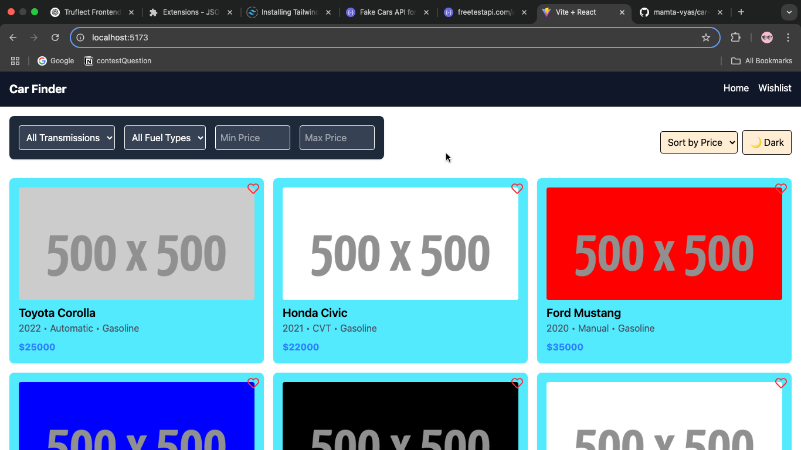

🚗 Car Finder Web App

A modern and responsive Car Finder Web App built with React.js, Vite, and Tailwind CSS. Search, filter, and explore car listings with real-time updates, a wishlist feature using localStorage, dark mode, and detailed car views.

## ✨ Features

- 🔍 Search and filter by brand, transmission, fuel type, price, and seating capacity

- ❤️ Wishlist functionality (stored in localStorage)

- 💡 Dark mode toggle

- 📱 Fully responsive design

- 🚀 Optimized with lazy loading and pagination

- 🎨 Smooth UI animations

- 🧠 Real-time filter updates with debouncing

## 📸 Screenshot

🚀 Tech Stack

React.js

Vite

Tailwind CSS

Redux Toolkit (for managing wishlist)

React Router DOM

🛠️ Installation

# Clone the repo
git clone https://github.com/yourusername/car-finder-app.git

# Navigate to the project directory
cd car-finder-app

# Install dependencies
npm install

# Start the dev server

npm run dev

🏗️ Folder Structure

src/
├── assets/
├── components/
│   ├── Header.jsx
│   ├── Filters.jsx
│   ├── CarCard.jsx
│   ├── CarList.jsx
├── pages/
│   ├── Home.jsx
│   ├── CarDetails.jsx
│   ├── Wishlist.jsx
├── redux/
│   ├── store.js
│   ├── wishlistSlice.js
├── App.jsx
├── main.jsx

🌚 Dark Mode
Dark mode is enabled using Tailwind's class strategy. Toggle it with a button in the header.

💡 Future Improvements

🔍 Sorting by price and year

🗂️ Category tabs (SUV, Sedan, etc.)

📍 Map view integration

🔐 User authentication

🤝 Contributing
Contributions are welcome! Feel free to open issues or submit PRs.

📄 License
This project is licensed under the MIT License.

👤 Author
Made by Mamta Vyas